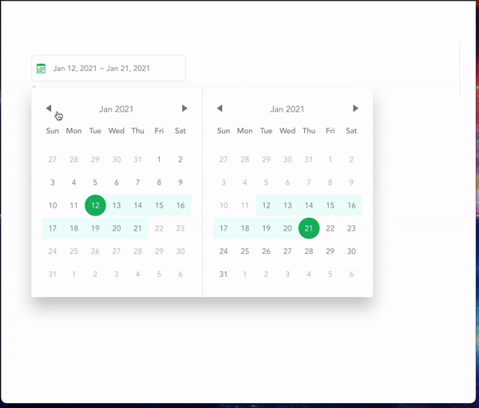
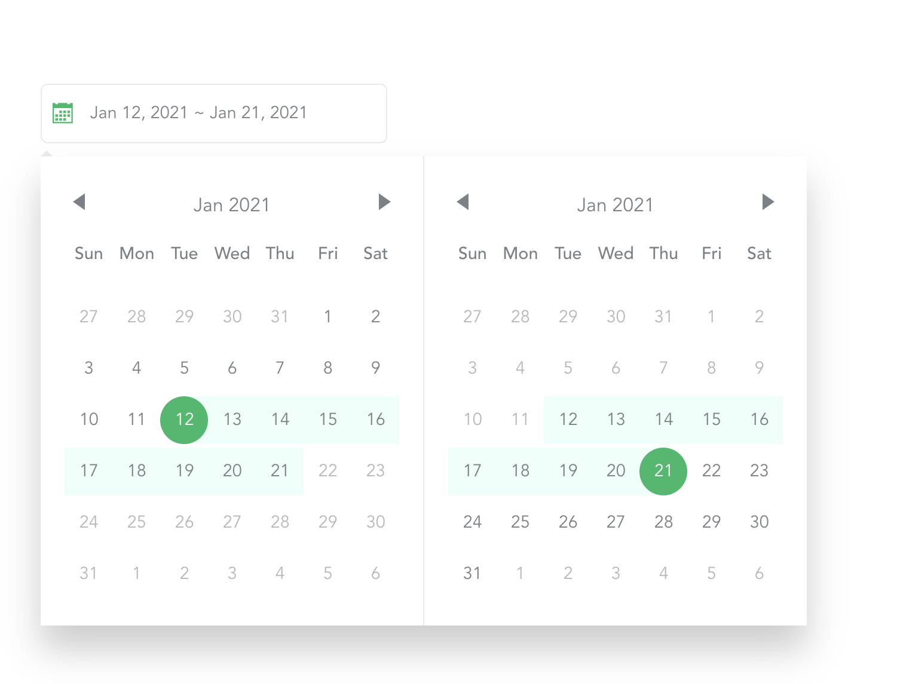
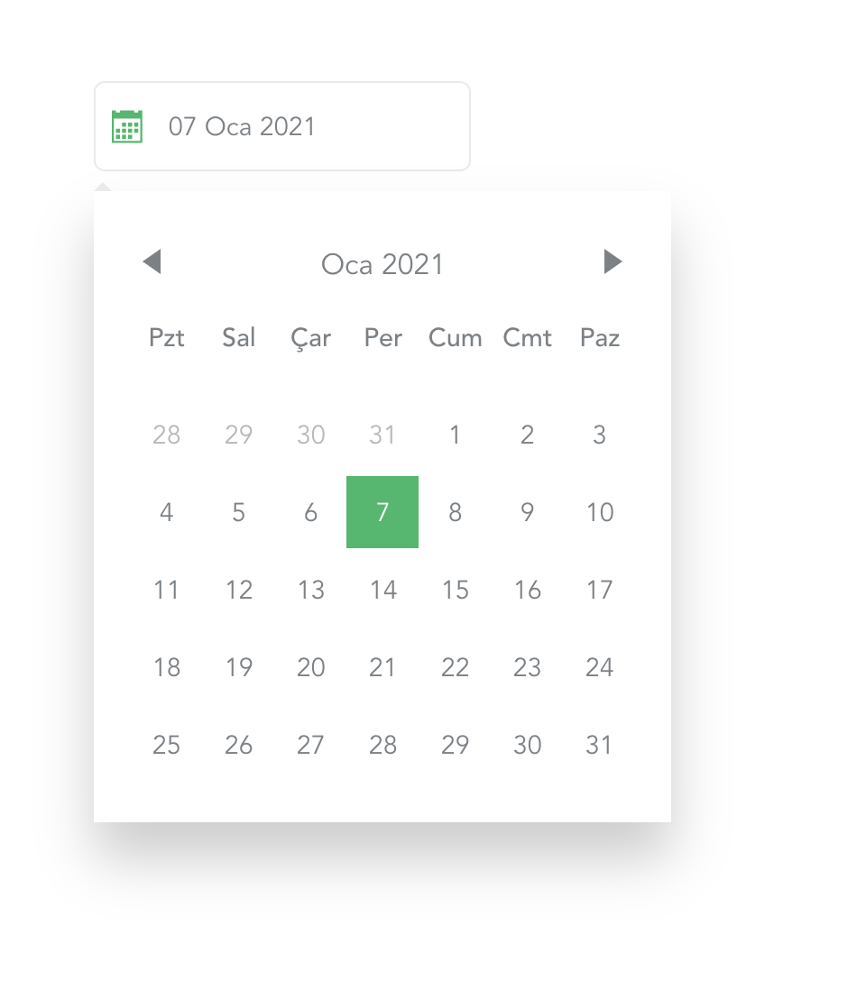
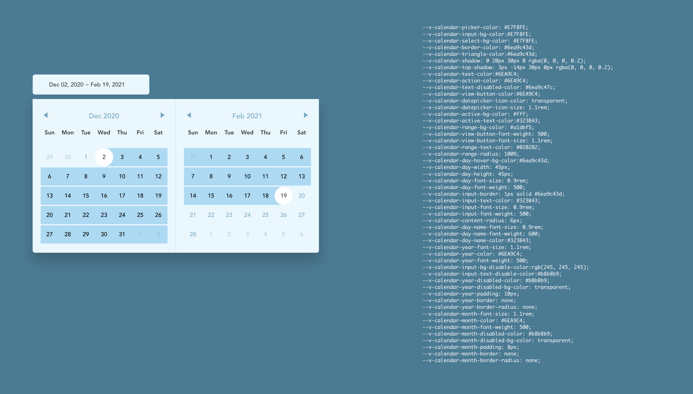

# Vue Datepicker Component

[](https://codecov.io/gh/edisdev/vue-datepicker-ui)


  >A Datepicker Component For VueJs
(https://edisdev.github.io/vue-datepicker-ui)


<hr>

<hr>


### Using

```javascript
// main.js file
import VueDatepickerUi from 'vue-datepicker-ui'
import 'vue-datepicker-ui/lib/vuedatepickerui.css';

Vue.component('Datepicker', VueDatepickerUi)
```
or

```vue
<script>
  import 'vue-datepicker-ui/lib/vuedatepickerui.css';
  import VueDatepickerUi from 'vue-datepicker-ui';

  export default {
    components: {
      Datepicker: VueDatepickerUi
    }
  }
</script>
```
and

```vue
<template>
  <datepicker ...props>
</template>
```
### Props
``` html
   <Datepicker 
    v-model="" 
    :range="" 
    :lang="" 
    :firstDayOfWeek="" 
    :input-class="" 
    :position="" 
    :disabled-start-date="" 
    :disabled-end-date=""
    :text-format="" 
    :date-format=""
    :disabled=""
    :placeholder=""
    :circle=""
    :show-clear-button=""
    :show-picker-inital=""/>
```

Prop | Type | Value |  Default
------------- | ------------- | ------------- | -------------
value (v-model) | Object | Date or Array for range | {}
range | Boolean | - | false
lang | String | Supports all languages / iso code language | tr
firstDayOfWeek | String | monday or sunday | monday
inputClass | String | classname for input | -
position | String | options = top, bottom, left, right | left
disabled-start-date | Object | This object consists of the start and end information(from and to params). ( For single status and range status of startDate). | { from: null, to: null}
disabled-end-date | Object | It has the same with disabled-start-end. (For range status of end Date. Ignored in single status.) | { from: null, to: null}
text-format | String | Short And Long / Short and long formats of month and day names | -
date-format | Object | This is the format in which the selected date will be displayed to the user. | { day: '2-digit', month: 'long', year: 'numeric' }
disabled | Boolean | This parameter is the datepicker prevents opening | false
placeholder | String | Input placeholder | Select Date
circle | Boolean | This is selected are circle or area | false
showClearButton | Boolean | This property is If there is a selected date, it allows the button used to delete this date to be displayed or not. | false
showPickerInital | Booelan | Show picker for on mounted | false

and customize style with css variables



```css
element {
  --v-calendar-picker-color: #fff;
  --v-calendar-input-bg-color: #fff;
  --v-calendar-input-bg-disable-color:rgb(245, 245, 245);
  --v-calendar-input-text-disable-color:#b8b8b9;
  --v-calendar-select-bg-color: #fff;
  --v-calendar-border-color: #eaeaeb;
  --v-calendar-triangle-color: #eaeaeb;
  --v-calendar-shadow: 0 20px 30px 0 rgba(0, 0, 0, 0.2);
  --v-calendar-top-shadow: 3px -14px 30px 0px rgba(0, 0, 0, 0.2);
  --v-calendar-text-color: #7b8187;
  --v-calendar-action-color: #7b8187;
  --v-calendar-text-disabled-color: #b8b8b9;
  --v-calendar-view-button-color: #7b8187;
  --v-calendar-view-button-font-weight: 400;
  --v-calendar-view-button-font-size: 1rem;
  --v-calendar-datepicker-icon-color: #1bba67;
  --v-calendar-datepicker-icon-size: 1.1rem;
  --v-calendar-active-bg-color: #1bba67;
  --v-calendar-active-text-color: #fff;
  --v-calendar-range-bg-color: #edfff9;
  --v-calendar-range-text-color: #7b8187;
  --v-calendar-range-radius: 100%;
  --v-calendar-day-hover-bg-color: #eaeaeb;
  --v-calendar-day-width: 40px;
  --v-calendar-day-height: 40px;
  --v-calendar-day-font-size: 0.9rem;
  --v-calendar-day-font-weight: 400;
  --v-calendar-day-name-font-size: 0.9rem;
  --v-calendar-day-name-font-weight: 500;
  --v-calendar-day-name-color: #7b8187;
  --v-calendar-input-border: 1px solid #eaeaeb;
  --v-calendar-input-text-color: #7b8187;
  --v-calendar-input-font-size: 0.9rem;
  --v-calendar-input-font-weight: 400;
  --v-calendar-content-radius: 0px;
  --v-calendar-year-font-size: 1.1rem;
  --v-calendar-year-color: #7b8187;
  --v-calendar-year-font-weight: 400;
  --v-calendar-year-disabled-color: #b8b8b9;
  --v-calendar-year-disabled-bg-color: transparent;
  --v-calendar-year-padding: 10px;
  --v-calendar-year-border: none;
  --v-calendar-year-border-radius: none;
  --v-calendar-month-font-size: 1.1rem;
  --v-calendar-month-color: #7b8187;
  --v-calendar-month-font-weight: 400;
  --v-calendar-month-disabled-color: #b8b8b9;
  --v-calendar-month-disabled-bg-color: transparent;
  --v-calendar-month-padding: 8px;
  --v-calendar-month-border: none;
  --v-calendar-month-border-radius: none;
}
```


DEMO (https://edisdev.github.io/vue-datepicker-ui)

#### note:
 **date-format** object values is consists to toLocaleString in js. (https://developer.mozilla.org/en-US/docs/Web/JavaScript/Reference/Global_Objects/Date/toLocaleString).


### Development:

Firstly

```bash
  yarn add --peer vue@next
```

Because, Vue is peer dependency.
Then,

```bash
  yarn install
```

```bash
  yarn docs:dev
```
