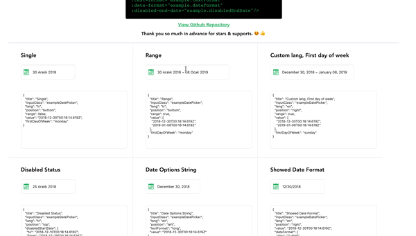

# Vue Datepicker Component
  >A Datepicker Component For VueJs
(https://edisdev.github.io/vue-datepicker-ui)

<hr>

<hr>


### Props
``` html
   <Calendar 
    v-model="" 
    :range="" 
    :lang="" 
    :firstDayOfWeek="" 
    :input-class="" 
    :position="" 
    :disabled-start-date="" 
    :disabled-end-date=""
    :text-format="" 
    :date-format=""/>
```

Prop | Value
------------- | -------------
value (v-model) | Date or Array for range
range | Boolean - (default: false)
lang | String / Supports all languages / iso code language / default: 'tr'
firstDayOfWeek | monday or sunday (default: monday)
inputClass | String / classname for input
position | String / options = top, bottom, left, right / default: left
disabled-start-date | Object . This object consists of the start and end information(from and to params). ( For single status and range status of startDate). Default: { from: null, to: null}
disabled-end-date | Object . It has the same with disabled-start-end. (For range status of end Date. Ignored in single status.)
text-format | String / Short And Long / Short and long formats of month and day names
date-format | Object / This is the format in which the selected date will be displayed to the user. / default: { day: '2-digit', month: 'long', year: 'numeric' }


DEMO (https://edisdev.github.io/vue-datepicker-ui)


#### note:
 **date-format** object values is consists to toLocaleString in js. (https://developer.mozilla.org/en-US/docs/Web/JavaScript/Reference/Global_Objects/Date/toLocaleString).
